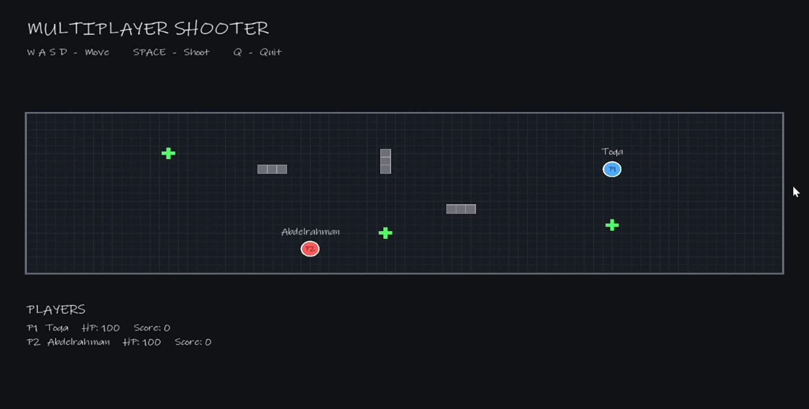

# C++ Multiplayer Shooter

A multiplayer shooter game built in **C++** using a client-server architecture. The project started as a console-based multiplayer game and was later extended with a graphical client using **SFML**.



## Features

* Multiplayer gameplay using TCP client-server communication
* Server-authoritative game state
* Player movement and shooting
* Player health and score tracking
* Power-ups
* Obstacles
* Real-time world state updates
* Graphical client built with SFML
* Player names displayed in the game
* Multiple clients can connect to the same server

## Architecture

The project is divided into three main parts:

* **Server** — Handles connections, game logic, player actions, and the authoritative game state.
* **Client** — Connects to the server, sends player commands, receives world updates, and displays the game.
* **Game Engine** — Contains the reusable game logic and systems used by the server.

The server remains responsible for the actual game state, while the client is responsible for displaying it.

## Technologies

* C++
* SFML 3.1.0
* TCP / Winsock
* Object-Oriented Programming
* Visual Studio

## Project Structure

```text
Multiplayer-Shooter/
├── Client/
├── GameEngine/
├── Server/
├── assets/
│   └── Inkfree.ttf
├── .gitignore
└── README.md
```

## How It Works

When a client connects, the server assigns the player an ID and adds them to the game.

The client sends commands such as:

* `MOVE_LEFT`
* `MOVE_RIGHT`
* `MOVE_UP`
* `MOVE_DOWN`
* `SHOOT`

The server processes these commands and periodically sends the updated world state back to the connected clients.

The graphical client then uses this information to render players, bullets, power-ups, and obstacles.

## My Work

I developed the project in C++ and worked on the game logic, client-server communication, and graphical client.

The original client was console-based. I later added the SFML graphical interface while keeping the existing server architecture unchanged.

## Notes

The project was developed as a university project and is intended as a learning project demonstrating multiplayer networking, object-oriented programming, and graphical rendering in C++.
